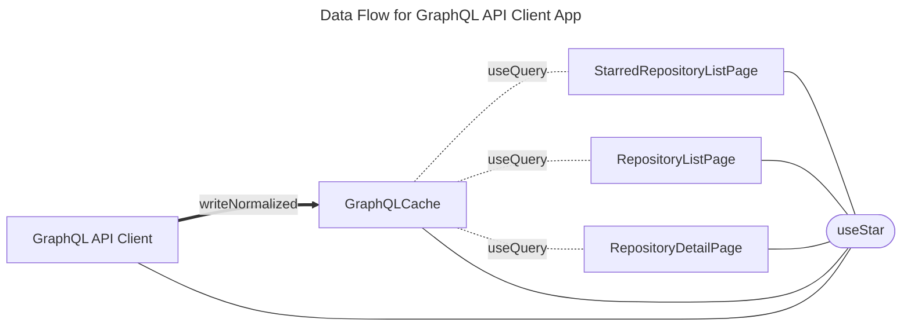
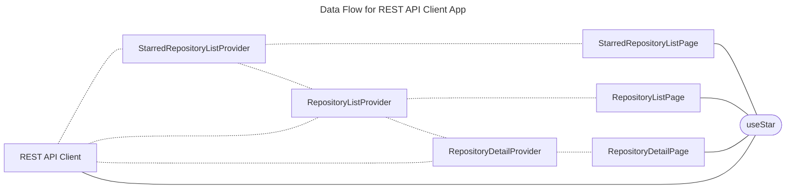

# GitHub REST and GraphQL API Client Flutter App

## Flutter アプリの状態の分類と管理例

| スコープ | SSOT | 命名例 | 説明 | 管理方法例 |
|--------|--------|--------|--------|--------|
| ephemeral | メモリ内 （Widget 内） | ephemeral state | 単一のWidgetに閉じた一時的な状態 | flutter_hooks |
| app | メモリ内 （ランタイム） | in memory state | 複数のWidgetで共有されるが、アプリの再起動やリロードでは保持されない状態。 | riverpod (Provider) |
| app | ローカルストレージ | persistent state | 複数のWidgetで共有され、ローカルストレージに永続化される状態。 | riverpod (Future/StreamProvider) |
| app | サーバやクラウド | remote state | サーバーやクラウドから取得・管理される状態。 | REST: riverpod (FutureProvider) GraphQL: graphql_flutter (useQuery) Firestore: riverpod (StreamProvider) | 

## Data Flow Design

